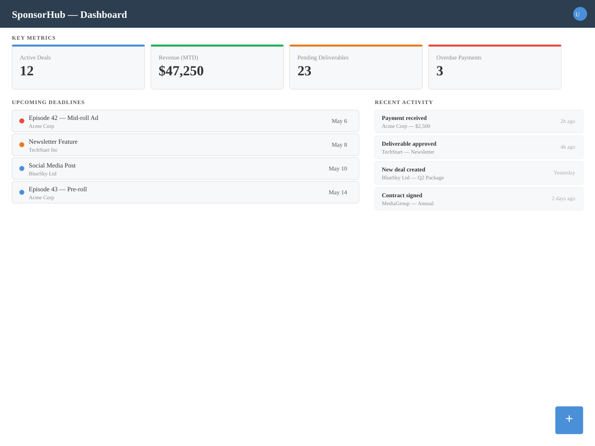
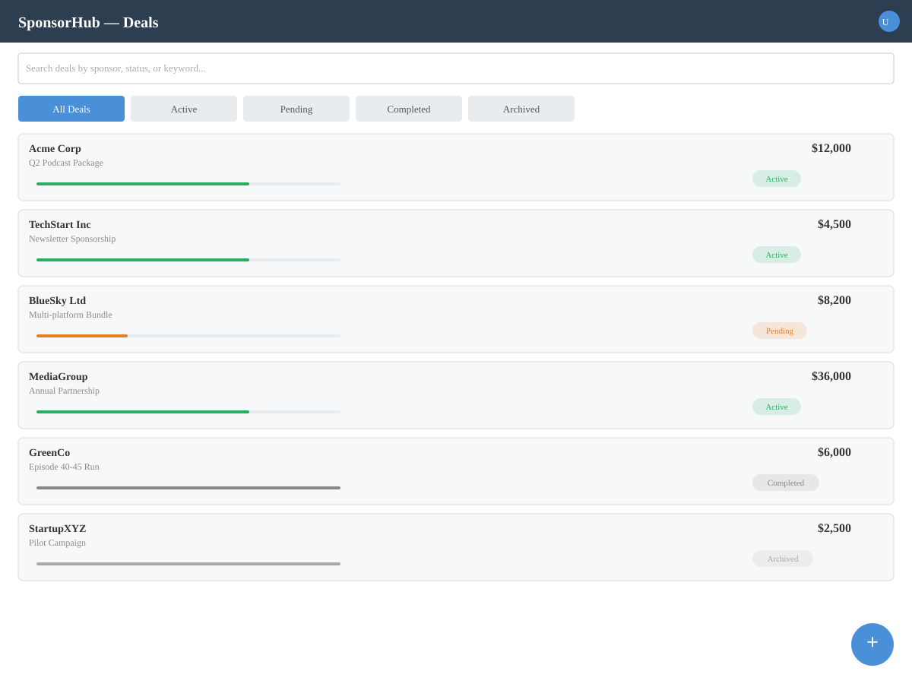
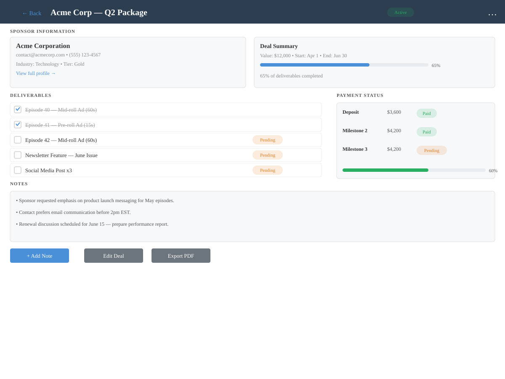
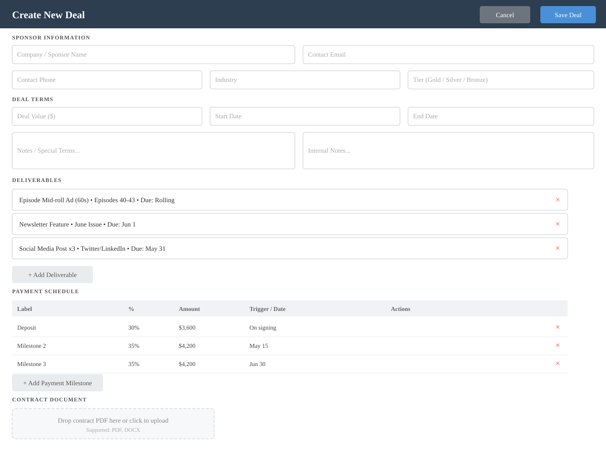
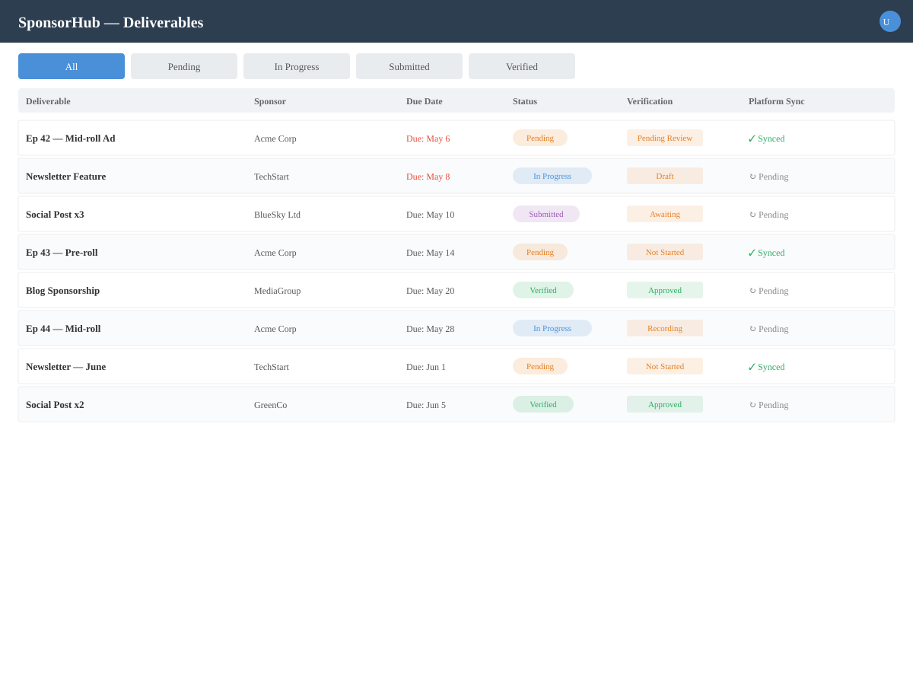
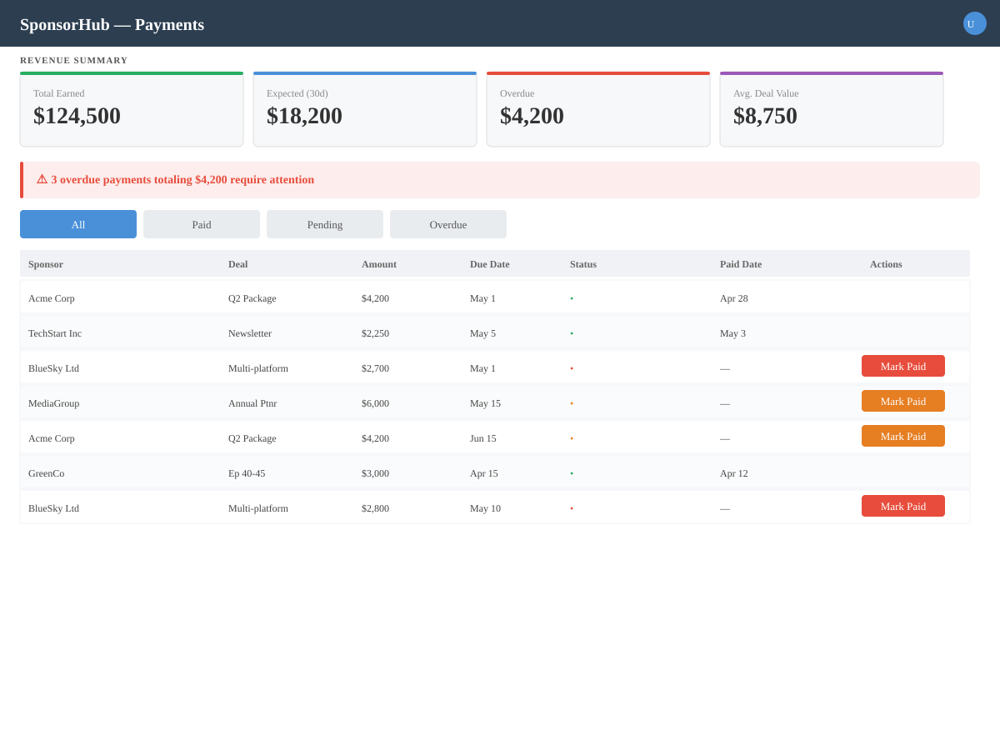
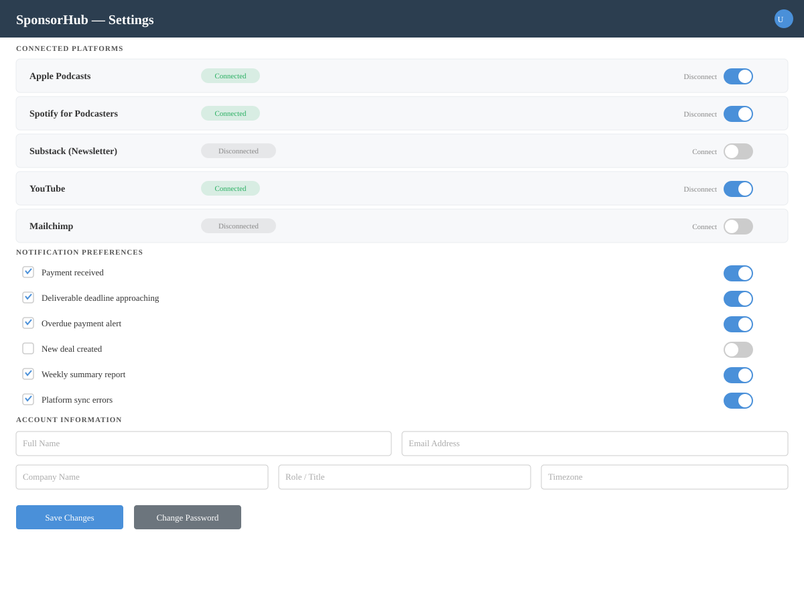

# Wireframes

Pencil wireframe previews for the SponsorHub sponsorship management application.

## Screens

- **Dashboard** — Provide an at-a-glance overview of active deals, upcoming deadlines, pending deliverables, and recent payment activity.
  

- **Deals List** — Browse, filter, and search all sponsorship deals with status badges and sort options.
  

- **Deal Detail** — Display a single sponsorship deal with its deliverables, timeline, sponsor contact info, payment status, and notes.
  

- **Deal Form** — Create or edit a sponsorship deal including sponsor details, agreed terms, deliverables, deadline, and payment schedule.
  

- **Deliverables Tracker** — Aggregate deliverables across all deals showing verification status, due dates, and platform sync indicators.
  

- **Payments** — Track expected and received payments across all deals with reconciliation status and overdue alerts.
  

- **Settings** — Manage connected podcast and newsletter platforms, notification preferences, and account details.
  
